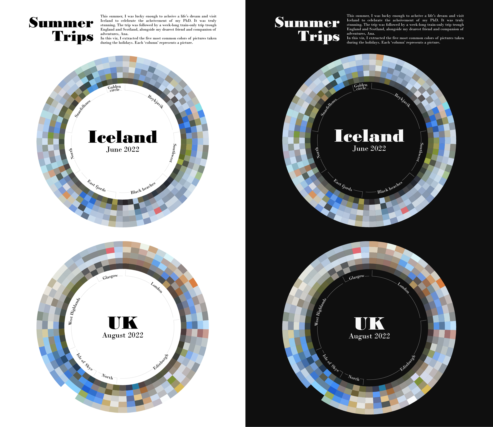
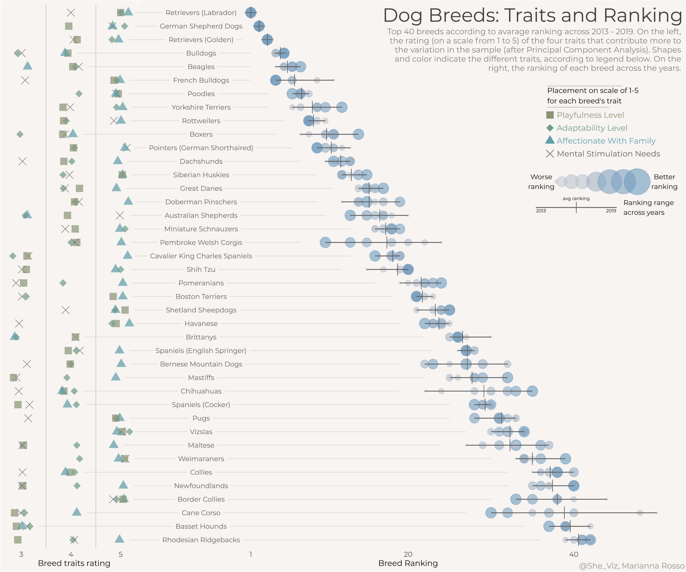

## Marianna Rosso, PhD

Selected visualizations and infographics,  
created for work, or for fun.

 

 

 

 

 

 

 

 
All visualization were created in R. 

For inquiries, questions, or chats: marianna.rosso3@gmail.com 
Research GitHub: https://github.com/marianna-rosso-uzh 
StrideLab GitHub: https://github.com/Ineichen-Group
